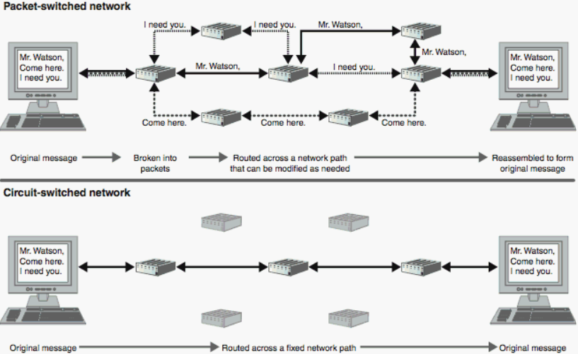
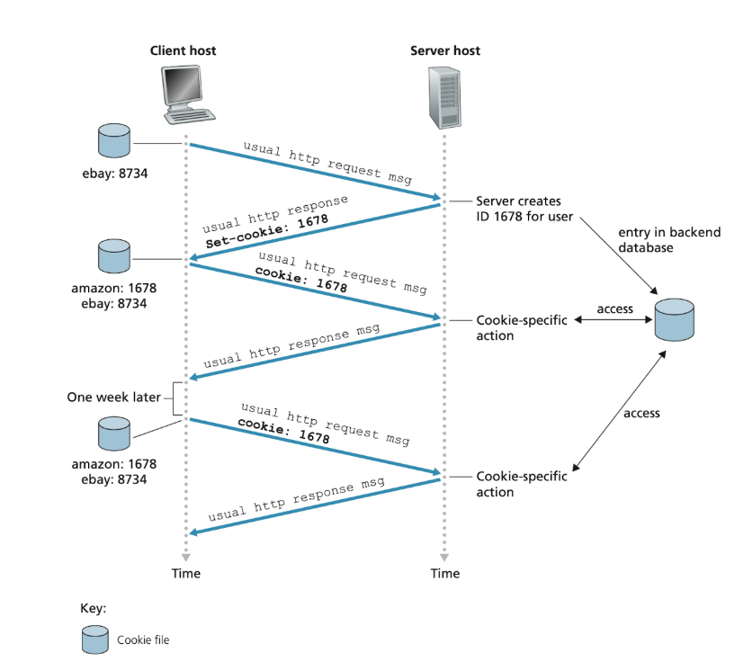

#  Computer Network Basics

컴퓨터 네트워크는 크게 **3가지 기본 프레임워크**로 설명할 수 있습니다.

## 1️⃣ Network Edge
- **구성 요소:** Application, Hosts (PC, 스마트폰, 서버 등)
- **역할:** 네트워크의 끝단에서 실제로 데이터를 생성하고 소비하는 주체
  - Client → User (웹 브라우저, 앱)
  - Server → 웹 서버, 게임 서버, 스트리밍 서버 등  
-  즉, 네트워크 엣지는 **네트워크를 이용하는 당사자들**이 위치한 부분입니다.

## 2️⃣ Network Core
- **구성 요소:** Routers
- **역할:**
  - 네트워크 엣지에서 온 데이터를 **빠르고 효율적으로 목적지로 전달**
  - 패킷 스위칭(Packet Switching) 기반
  - 경로 선택(Routing) 알고리즘 사용
  - 네트워크 자체는 데이터를 이해하지 않으며, 단지 최적 경로로 전달하는 역할
-  고속도로 역할에 비유할 수 있습니다 !

## 3️⃣ Access Networks & Physical Media
- **구성 요소:** Communication Links
- **역할:** 사용자의 호스트(엣지)와 네트워크 코어를 물리적으로 연결하는 구간
- **접속 네트워크 종류:**
  - 가정/사무실: 이더넷, 와이파이
  - 이동통신: LTE, 5G
  - ISP 제공: 광케이블, DSL
- **물리 매체 예시:** UTP 케이블, 동축 케이블, 광케이블, 무선 전파

---

# 🔄 Circuit Switching vs Packet Switching

## ✔ Circuit Switching
- **개념:** 통신 시작 전에 두 단말 간 전용 경로(회선)를 예약
- **특징:**
  - 전송 중 다른 사용자와 경로 공유 ❌ (독점적 사용)
  - 연결(Setup) 시간 필요
  - 지연이 일정 (QoS 보장)
- **Ex:** 옛날 유선 전화망, LTE 음성통화
- ✅ Pros: 안정적, QoS 보장  
- ❌ Cons: 비효율적 (대기 중에도 회선 자원 차지)

---

## ✔ Packet Switching
- **개념:** 메시지를 잘게 쪼개 패킷 단위로 전송, 각 패킷은 라우터를 거쳐 독립적으로 경로 선택
- **특징:**
  - 전용 회선 없음 → 자원 효율적 사용
  - 혼잡 시 지연 발생 가능
  - 패킷 순서 뒤바뀔 수 있음
- **Ex:** 인터넷(IP 네트워크), 이메일, 웹 브라우징
- ✅ Pros: 효율적, 자원 공유 가능  
- ❌ Cons: 혼잡 시 큐잉 지연 발생, QoS 보장 어려움

---

#  Nodal Delay (라우터에서의 지연 요소 4가지)

## (1) Processing Delay (처리 지연)
- 패킷 헤더 검사, 목적지 확인, 오류 검사 등에 소요
- 일반적으로 **μs 수준** (짧음)
- 좋은 라우터 사용 → 지연 감소 가능

---

## (2) Queuing Delay (큐잉 지연)
- 패킷이 큐(버퍼)에서 대기하는 시간
- 네트워크 혼잡 상태에 따라 **ms ~ 초 단위**까지 증가 가능
- 가장 **예측 불가하고 큰 지연 요인**

---

## (3) Transmission Delay (전송 지연)
- 패킷을 링크로 내보내는 데 걸리는 시간  
- 계산식: `L / R`  
  - L = 패킷 길이 (bits)  
  - R = 링크 전송률 (bps)  
- 회선 대역폭 증설 시 지연 완화 가능  
- 예: 1,000bit 패킷을 1Mbps 회선으로 보낼 때 → 1ms

---

## (4) Propagation Delay (전파 지연)
- 신호가 매체(광섬유, 구리선, 무선)를 따라 전달되는 시간  
- 계산식: `d / s`  
  - d = 거리 (m)  
  - s = 전파 속도 (~2×10^8 m/s, 광섬유에서 빛 속도 수준)  
- 거리 기반 → 서울 ↔ 미국 약 10,000km → 최소 50ms  
- 물리적으로 줄이기 어려움 (케이블 단축, 더 빠른 매체 필요)

---

#  Summary
- **네트워크 프레임워크:**  
  - Edge (데이터 생성/소비), Core (라우터), Access & Media (물리적 연결)
- **전송 방식:**  
  - Circuit Switching (안정적, 비효율적)  
  - Packet Switching (효율적, 혼잡 시 지연 발생)
- **Nodal Delay:**  
  - Processing, Queuing, Transmission, Propagation

---
# Computer Network: Cookie & Web Cache

-
##  Cookie 🍪

### 개념
HTTP 프로토콜은 **stateless (상태 비저장)** 이며, 서버는 클라이언트가 이전에 누구였는지 기억하지 못한다.  
그래서 **쿠키(cookie)** 를 사용해서 사용자 상태를 식별하고, 세션을 유지한다.  
쿠키는 서버가 생성하여 **클라이언트(브라우저)에 저장하는 작은 데이터 조각**이다.

### 동작 과정
1. **클라이언트 → 서버 요청**  
   - 사용자가 브라우저로 `amazon.com` 접속 (HTTP request 보냄)

2. **서버 → 클라이언트 응답 (쿠키 발급)**  
   - 서버가 유저를 구분하기 위해 ID를 생성 (예: `1678`)  
   - HTTP response header에 `Set-Cookie: 1678` 을 넣어 전달  
   - 브라우저는 이 값을 로컬에 저장  

3. **이후 요청 시 쿠키 전송**  
   - 클라이언트가 다시 Amazon 서버에 요청할 때  
   - request header에 `Cookie: 1678` 을 자동으로 첨부  
   - 서버는 DB에서 해당 ID를 찾아 사용자-specific 동작(장바구니, 로그인 유지 등)을 수행  

4. **일주일 뒤에도 지속**  
   - 쿠키가 만료되지 않았다면, 브라우저는 계속 `Cookie: 1678` 을 요청과 함께 보냄  
   - 따라서 서버는 사용자를 식별할 수 있음  

-

### Cookie 한계와 보완
- 쿠키는 **클라이언트에 저장**되므로 보안 위험 (도난/위조 가능)  
  → `HttpOnly`, `Secure`, `SameSite` 옵션 필요  
- 용량이 작음 (대략 4KB) → 많은 데이터 저장 불가  
- 대안으로 **세션(Session)**, **JWT**, **토큰 기반 인증** 방식도 사용됨  

---

## Web Cache (Proxy Server)

### 개념
Web Cache (프록시 서버)는 **클라이언트와 서버 사이에 위치하는 중간 저장소**이다.  
자주 요청되는 웹 콘텐츠(HTML, 이미지, 동영상 등)를 **임시로 저장(caching)** 하여,  
다음 요청 시 원 서버(origin server)가 아니라 **캐시 서버에서 바로 제공**한다.  

(ex. 회사 내부 프록시 서버, ISP 캐시, CDN 등)

### 동작 과정
1. 클라이언트가 웹 페이지 요청 (예: `GET /index.html`)  
2. 요청이 웹 캐시 서버에 도착  
   - (Hit) 캐시에 해당 객체가 있으면 → 바로 응답 (origin server까지 가지 않음)  
   - (Miss) 캐시에 없으면 → origin server에 요청 → 응답을 캐시에 저장 → 클라이언트에 전달  
3. 이후 다른 사용자가 같은 페이지 요청 시, 캐시에서 바로 제공  

---

### 장점
1. **지연 감소** : 캐시 서버가 가까운 곳에 있어서 응답 시간이 빨라진다.  
2. **대역폭 절약** : 같은 리소스를 origin server에서 반복적으로 다운로드하지 않아도 된다.  
3. **서버 부하 감소** : CDN이 트래픽을 분산처리하여 서버 과부하를 방지한다.  

---

### 단점
1. **데이터 신선도 문제**  
   - 캐시된 데이터가 origin server의 최신 상태와 다를 수 있음  
   - → 해결: 캐시 만료 정책(TTL, ETag, If-Modified-Since 등) 사용  

2. **보안 이슈**  
   - HTTPS 같은 암호화된 트래픽은 단순 캐싱이 어려움  
   - → SSL/TLS Termination Proxy 필요  

---