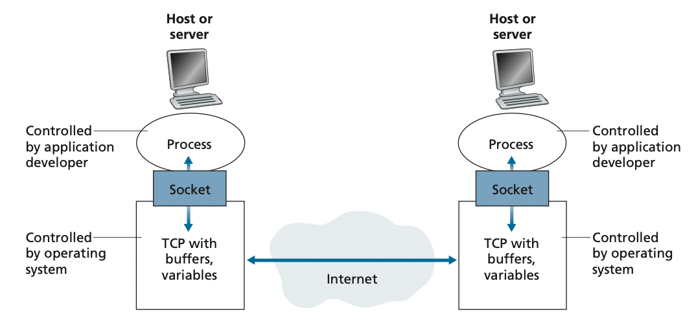
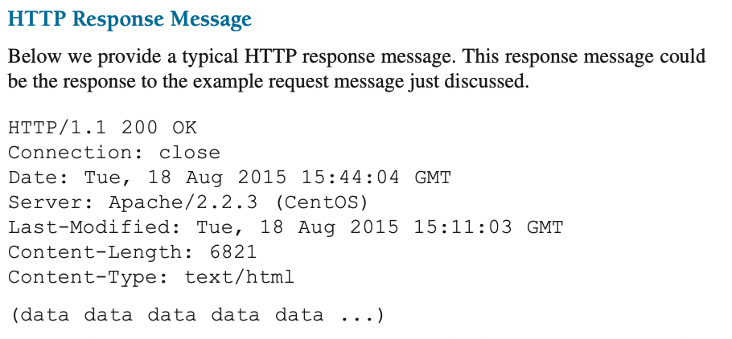
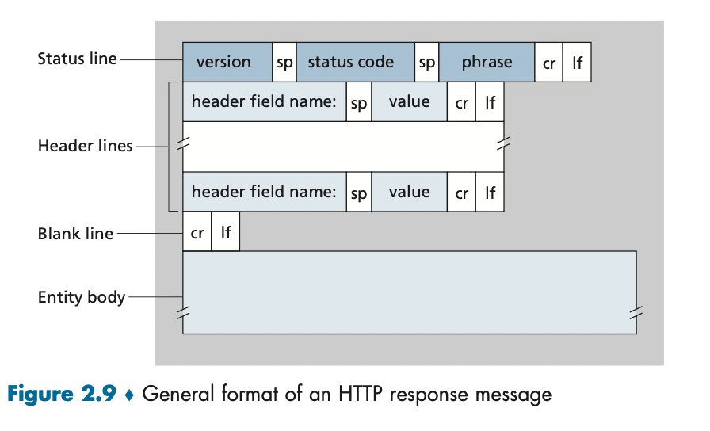

# Application Layer

---

## 개요

---

- Network App은 운영체제 위에서 실행되는 프로세스
  - 결국 **다른 머신의 프로세스와 통신**하는 것.
  - 다른 머신과의 통신 <br> => **IPC**.(그 중에서 **Socket**)

## Network Application 원리

--- 


**목표**
- 다른 종단 시스템에서 동작하고 네트워크를 통해 서로 통신하는 프로그램을 작성하는 것. <br> 서버 <-> 클라이언트, p2p 파일 공유 시스템

### Network Application Architecture
> 개발자에 의해 설계되고 애플리케이션이 다양한 종단 시스템에서 
> 어떻게 조직되어야하는 지를 지시

**Client - Server Architecture**
- Server
  - 항상 켜져 있는 Host
  - 항상 같은 장소 -> Permanent IP Address
  - Port 번호 고정 <br> ex) Well Known Port: HTTP: 80, SMTP: 25, HTTPS: 443
- Client
  - Server에게 Request를 보내는 존재
  - Dynamic IP Address
  - 필요에 의해서만 요청
- Socket에 정확하게 전달하기 위해서 <br> -> IP Address(머신) + Port(프로세스)
- Host name은 32bit의 이진수
  - DNS를 사용하여 32bit 주소를 얻음
- 클라이언트끼리 직접 통신 X

**P2P Architecture**
- 항상 켜져있는 기반구조 서버에 최소로 의존.
- peer라는 간헐적으로 연결된 호스트쌍이 직접 통신.
- 특정 서버를 통하지 않고 피어가 통신하므로 peer-to-peer
- 인기있고 트래픽 집중적인 애플리케이션은 p2p구조 ⇒ 인스턴스 메시징 애플리케이션의 경우.
- 자가 확장성(self-scalability): new peers bring new service capacity, as well as new service demands

### Interface Between Process and Computer
> 실제 통신하는 것은 프로그램이 아닌 프로세스!

**Process**
- 종단 시스템(app)에서 실행되는 프로그램
- 통신 프로세스가 같은 종단 시스템에서 실행 될 때 서로 프로세스 간에 통신.
- 규칙은 OS에 의해 좌우됨.
- 2개의 다른 종단 시스템에서 프로세스는 컴퓨터 네트워크를 통한 message 교환으로 통신.

**프로세스와 컴퓨터 네트워크 사이의 인터페이스**

- 통신 프로세스 쌍으로 구성되어 서로 메시지를 보낸다.
- 프로세스는 **소켓**을 통해 네트워크로 메시지를 주고 받는다.
- **소켓**은 API. 통신하기 위한 interface
- 애플리케이션 개발자는 소켓의 애플리케이션 계층에 대한 모든 통제권을 갖고 소켓의 트랜스포트 계층에 대한 통제권은 갖지 못한다.

**프로세스 주소배정**

특정 목적지로 메시지를 전달하기 위해, 주소를 가지고 있어야 함. <br>
수신 프로세스를 식별하기 위해 필요한 두가지 정보 <br>

1. Host Address => **IP Address**
2. Destination Host Process => **Port Number**

## Web and HTTP

---

> Web => On-demand 방식으로 동작
> On-demand: 그들이 원할 때 원하는 것을 수신

### HTTP 개요
>웹 애플리케이션 계층 프로토콜 ⇒ HTTP(HyperText Transfer Protocol)
> 클라이언트와 서버는 서로 다른 시스템에서 HTTP 메시지를 교환하여 통신

```thymeleafurlexpressions
http://www.SSAFY.edu/someDepartment/picture.gif
```

- ```www.SSAFY.edu```: Host name
- ```/someDepartment/picture.gif```: path name

**HTTP**
- 클라이언트가 서버에게 어떻게 페이지를 요청하는지와 <br> <br>
서버가 클라이언트로 어떻게 웹 페이지를 전송하는 지를 정의하는 프로토콜
- 사용자가 웹 페이지를 요청할 때 브라우저는 페이지 내부의 객체에 대한 HTTP 요청 메시지를 서버에게 보낸다.
- 서버는 요청을 수신하고 객체를 포함하는 HTTP 응답 메시지로 응답한다.
- **TCP**를 전송 프로토콜로 사용
- HTTP client는 서버에게 TCP 연결을 시작. ⇒ 비용 발생.(TCP Connection)
- 서버가 클라이언트에게 요청 파일을 보낼 때 서버는 클라이언트에 관한 어떠한 상태 정보도 저장하지 않는다. <br> ⇒ 정보를 유지하지 않는 것. stateless protocol

### Non-Persistent and Persistent Connections

> 클라이언트가 일련의 요청(request)을 하고 서버가 응답(response)을 하면서 일정 시간 동안 통신이 유지된다.  
> 이러한 통신은 일정한 간격으로 주기적이거나 간헐적으로 발생할 수 있다.

**🔄 Non-Persistent Connection (비지속 연결)**

- 각 요청/응답 쌍마다 **새로운 TCP 연결**을 설정하고 종료함.
- **연결이 짧게 유지**되며, 여러 개의 리소스를 요청할 경우 **매번 연결을 재설정**해야 함.
- 오버헤드가 크고, 지연 시간이 발생할 수 있음.
- 주로 **HTTP/1.0**에서 사용됨.

```text
[Client] --request--> [Server]
         <--response-- 
[Connection Closed]

[Client] --request--> [Server]
         <--response-- 
[Connection Closed]
```

**🔁 Persistent Connection (지속 연결)**
- 하나의 TCP 연결을 통해 **여러 요청과 응답**을 주고받음. 
- 연결이 계속 열려 있으므로 성능이 향상되고, 지연 시간이 줄어듦. 
- **Connection: keep-alive 헤더**를 통해 유지됨. 
- 기본적으로 HTTP/1.1 이상에서 사용됨.

``` text
[Client] --request1--> [Server]
<--response1--

         --request2--> 
         <--response2-- 

         --request3--> 
         <--response3-- 
[Connection Closed]
```
**비교**

| 항목             | Non-Persistent             | Persistent                     |
|------------------|----------------------------|--------------------------------|
| 연결 수명        | 요청마다 새로 연결         | 다수의 요청/응답 공유         |
| 연결 방식        | 요청/응답 후 연결 종료     | 연결을 유지하면서 여러 요청 처리 |
| 오버헤드         | 큼 (매번 연결/해제 반복)   | 적음 (한 번 연결로 여러 요청) |
| 지연 시간        | 상대적으로 길어질 수 있음 | 상대적으로 짧음              |
| HTTP 버전        | HTTP/1.0                   | HTTP/1.1 이상                  |
| 성능             | 낮음                       | 높음                           |

### HTTP Message Format

**HTTP Request Message**


**특징**
1. Human Readable
2. CR과 LF(carriage return & line feed)로 구분
3. 메시지 끝에는 **추가적인 CRLF 줄**이 붙어 메시지 종료를 알림
4. 메시지는 아래의 **세 가지 주요 구성 요소**로 이루어짐:
  - Request Line
  - Header Fields
  - Message Body (선택)

**HTTP Request Message Format**

**Format**

```
<HTTP 메서드> <Request-URI> <HTTP 버전>
Header1: Value1
Header2: Value2
...

<Message Body> (선택)
```

예시:

```
GET /index.html HTTP/1.1
Host: www.example.com
Connection: close
User-Agent: Mozilla/5.0
Accept-Language: fr
```

---

## 📌 구성 요소

### 1️⃣ Method

```http
<HTTP 메서드> <Request-URI> <HTTP 버전>
```

예:
```
GET /index.html HTTP/1.1
```

- **Method 종류 및 설명**

| Method   | 설명                                   | 특성             |
|----------|----------------------------------------|------------------|
| `GET`    | URL에 정보를 포함하여 리소스 요청      | 쿠키 사용 가능, 캐싱 가능 |
| `POST`   | 데이터 전송 (요청 본문에 포함)         | 주로 폼 전송에 사용 |
| `HEAD`   | 리소스의 헤더만 요청                   | 응답 본문 제외 |
| `PUT`    | 리소스 전체 수정                       | **멱등** |
| `PATCH`  | 리소스 부분 수정                       | 멱등 아님 |
| `DELETE` | 리소스 삭제                            | **멱등** |

> 💡 **멱등성 (Idempotency)**: 같은 요청을 여러 번 보내도 같은 결과를 얻는 성질

---

### 2️⃣ Header Fields


- 각 헤더는 `Key: Value` 형식
- 요청에 대한 메타정보 제공

| 헤더 필드          | 설명 |
|--------------------|------|
| `Host`             | 요청한 호스트 이름 (예: `www.someschool.edu`) |
| `Connection: close`| 서버에게 지속 연결을 사용하지 않겠다는 신호 |
| `User-Agent`       | 브라우저나 클라이언트 종류 명시 |
| `Accept-Language`  | 원하는 언어 버전 명시 (예: `fr`) |

> 🔸 헤더는 **프록시 서버나 캐시 서버를 거칠 때**도 중요한 역할을 합니다.

---

### 3️⃣ Body (본문)

- 요청에 포함되는 데이터
- **POST**, **PUT**, **PATCH** 요청에서 주로 사용
- 예: 로그인 정보, JSON, XML 등

```json
{
  "username": "chatgpt",
  "password": "secure123"
}
```

---

### ✅ 요약

HTTP Request는 다음 3가지 주요 구성으로 이루어져 있습니다:

1. **Method**: 요청의 유형과 대상 명시
2. **Headers**: 요청에 대한 부가 정보 전달
3. **Body**: (선택적) 서버로 보내는 데이터

## HTTP Response Message

---

### 📩 구조 개요

  


- HTTP 응답 메시지는 다음과 같은 구조로 구성됩니다:

```
<Status Line>
<Header Fields>

<Entity Body>
```

- 주요 구성:
  1. **Status Line** (상태 라인)
  2. **Header Fields** (헤더 라인들)
  3. **Entity Body** (본문)

---

## 🔷 1. Status Line (상태 라인)

```
<HTTP-Version> <Status-Code> <Reason-Phrase>
```

예시:

```
HTTP/1.1 200 OK
```

- 세 가지 필드로 구성:
  - **버전 필드**: HTTP/1.0, HTTP/1.1 등
  - **상태 코드**: 서버 처리 결과를 나타내는 숫자 코드
  - **상태 메시지**: 코드에 대한 설명 텍스트

---

## 🔶 2. Header Fields (헤더 라인)

| 헤더 이름             | 설명 |
|------------------------|------|
| `Connection: close`    | 메시지를 보낸 후 TCP 연결을 닫음 |
| `Date`                 | 응답이 생성된 날짜 및 시간 |
| `Server`               | 서버 소프트웨어 정보 (예: Apache) |
| `Last-Modified`        | 리소스가 마지막으로 수정된 시간 |
| `Content-Length`       | 본문의 바이트 크기 |
| `Content-Type`         | 전송된 데이터의 MIME 타입 (예: text/html) |

> 📌 이 헤더들은 클라이언트의 처리, 캐싱, 연결 유지 등에 영향을 줍니다.

---

## 📦 3. Entity Body

- 실제 응답 데이터 (HTML, JSON, 이미지 등)가 포함됨
- 상태 코드가 `200 OK`, `400 Bad Request` 등일 때 본문이 포함될 수 있음
- 예시:

```html
<html>
  <head><title>Hello</title></head>
  <body>Hello, World!</body>
</html>
```

---

## 🔁 주요 상태 코드

| 상태 코드 | 메시지                  | 설명 |
|-----------|-------------------------|------|
| `200 OK`  | 요청이 성공적으로 처리됨 | 정상 응답과 함께 콘텐츠 포함 |
| `301 Moved Permanently` | 리소스가 영구적으로 이동됨 | 새로운 위치는 `Location` 헤더에 표시됨 |
| `400 Bad Request` | 잘못된 요청              | 요청 문법 오류 등 |
| `404 Not Found` | 리소스를 찾을 수 없음     | URI에 해당하는 리소스 없음 |
| `505 HTTP Version Not Supported` | 지원하지 않는 HTTP 버전 | 서버가 해당 버전 처리 불가 |

---

### ✅ 응답 메시지 예시

```http
HTTP/1.1 200 OK
Date: Sun, 03 Aug 2025 12:00:00 GMT
Server: Apache/2.4.1 (Unix)
Last-Modified: Sat, 02 Aug 2025 18:30:00 GMT
Content-Length: 137
Content-Type: text/html
Connection: close

<html>
  <head><title>Example</title></head>
  <body><h1>Hello, world!</h1></body>
</html>
```

---

> 📝 HTTP 응답 메시지는 브라우저나 클라이언트가 서버의 처리 결과를 이해하는 데 핵심적인 역할을 하며, 
> 특히 상태 코드와 헤더의 조합은 요청 처리 결과를 명확히 전달합니다.

## 🍪 사용자와 서버 간의 상호작용: 쿠키 (Cookies)

---

### 📌 HTTP는 상태 비저장(stateless) 프로토콜

- HTTP는 기본적으로 **요청 간 상태를 저장하지 않음**.
- 이는 서버 설계를 단순화하고, 동시에 수천 개의 TCP 연결을 효율적으로 처리할 수 있게 함.
- 그러나 **사용자 맞춤형 서비스**, **로그인 상태 유지**, **쇼핑카트 유지** 등을 위해 상태 정보가 필요한 경우가 많음.

---

### ✅ 쿠키(Cookie)의 개념

- **쿠키는 클라이언트 측에 저장되는 작은 데이터 조각**으로, 서버가 클라이언트를 식별하기 위해 사용됨.
- HTTP 요청/응답 메시지의 헤더에 포함되어 **서버와 클라이언트 간 상태를 간접적으로 유지**할 수 있게 함.

---

### 📊 쿠키 구성 요소

1. **HTTP 응답 메시지의 `Set-Cookie` 헤더**
  - 서버가 클라이언트에게 쿠키 데이터를 생성하여 전송
2. **HTTP 요청 메시지의 `Cookie` 헤더**
  - 클라이언트가 서버에 요청 시 쿠키를 함께 보냄
3. **클라이언트의 쿠키 저장소 (브라우저 내부 파일)**
  - 브라우저가 쿠키를 로컬에 저장하여 관리
4. **서버 측 데이터베이스**
  - 쿠키의 식별 번호와 관련된 정보를 서버가 저장함

---

### 🔄 쿠키 동작 흐름


1. 사용자가 웹 사이트에 **최초 접속**.
2. 서버는 **고유한 식별자(ID)**를 생성하고, 백엔드 DB에 관련 정보를 저장.
3. 서버는 응답 시 `Set-Cookie` 헤더로 식별자 전달:

   ```http
   Set-Cookie: session_id=abc123; Path=/; HttpOnly
   ```

4. 브라우저는 쿠키를 로컬 파일에 저장.
5. 이후 같은 웹 사이트에 요청 시, 브라우저는 해당 쿠키를 함께 전송:

   ```http
   Cookie: session_id=abc123
   ```

6. 서버는 쿠키의 `session_id`를 바탕으로 사용자를 식별하고, 맞춤 콘텐츠 또는 로그인 상태 유지 등을 처리.

---

### 🔐 개인정보 및 보안 관련 사항

- 쿠키는 **사용자 식별자**, **로그인 상태**, **세션 정보** 등을 담을 수 있어 **개인정보 보호 이슈**가 발생할 수 있음.
- `HttpOnly`, `Secure`, `SameSite` 속성 등을 통해 보안 수준을 향상시킬 수 있음.
- 쿠키는 클라이언트에 저장되므로 **조작 가능성**이 존재 → 중요한 데이터는 서버에 저장해야 함.

---

### 💬 정리

| 항목              | 설명 |
|-------------------|------|
| 상태 유지 필요성  | HTTP는 상태 비저장이라, 사용자 식별 필요 시 쿠키 사용 |
| 저장 위치         | 클라이언트 브라우저 (파일 시스템 내부) |
| 전달 방식         | HTTP 요청/응답 메시지 헤더에 포함 |
| 주요 용도         | 로그인 유지, 사용자 맞춤 설정, 쇼핑카트 등 |
| 보안 고려사항     | XSS/CSRF 방지 설정 필수 (HttpOnly, SameSite 등) |

---

> 쿠키는 웹 애플리케이션에서 사용자 맞춤화와 세션 관리를 위해 필수적인 메커니즘이지만, 적절한 보안 설정 없이는 개인정보 유출 위험이 존재합니다.
