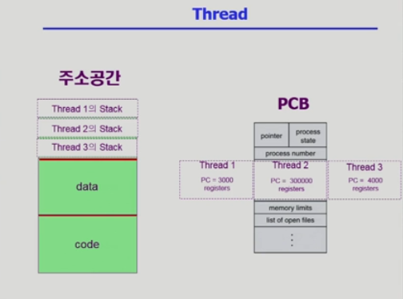
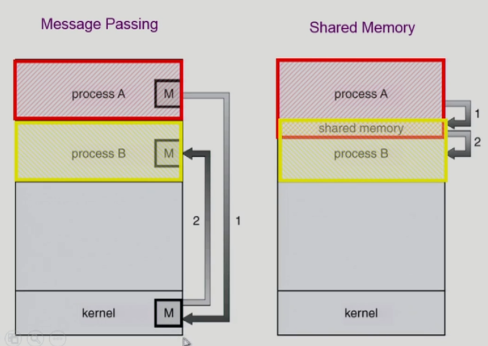
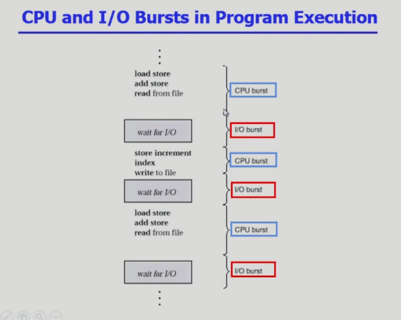

# 스케줄러 정리

## 1. 스케줄러 개요

스케줄러는 어떤 프로세스에게 자원을 할당할지를 결정하는 운영체제 커널의 모듈이다. 스케줄러는 역할에 따라 장기, 중기, 단기 스케줄러로 나뉜다.

### 장기 스케줄러 (Long-term scheduler)

- **잡 스케줄러** (Job scheduler)라고도 부른다.
- 어떤 프로세스를 Ready Queue에 삽입할지 결정하고, 프로세스에 메모리를 할당하는 문제를 결정한다.

### 단기 스케줄러 (Short-term scheduler)

- **CPU 스케줄러** (CPU scheduler)라고도 한다.
- Ready 상태의 프로세스 중에서 어떤 프로세스에게 CPU를 할당할지 결정한다.
- 밀리초(ms) 단위의 매우 짧은 주기로 실행되어야 하므로 가장 빈번하게 호출된다.

### 중기 스케줄러 (Medium-term scheduler)

- **스와퍼** (Swapper)라고도 부른다.
- 메모리에 적재된 프로세스 수를 동적으로 조절하기 위해 프로세스를 일시적으로 메모리에서 디스크로 쫓아내는 역할을 한다. (**스와핑, Swapping**)
- 스와핑을 통해 시스템의 과부하를 막고 메모리 공간을 확보할 수 있다.

---

## 2. 스레드

- **스레드** (Thread)는 프로세스 내에서 CPU 수행의 기본 단위이다.
- 하나의 프로세스는 하나 이상의 스레드를 가질 수 있으며, 같은 프로세스에 속한 스레드들은 프로세스의 Code, Data, Heap 영역을 공유한다.
- 각 스레드는 자신만의 Stack과 PC Register를 가진다.

### 예시

브라우저에서 10,000개의 탭을 띄운다면:

- **프로세스 기반**: 10,000개의 독립적인 메모리 공간과 PCB 필요 → 자원 낭비.
- **스레드 기반**: 하나의 브라우저 프로세스 내에서 각 탭을 스레드로 관리 → Code, Data 공유, Stack과 PC만 별도로 필요 → 효율적.

### 스레드의 이점

- **응답성** (Responsiveness): 한 스레드가 블록되어도 다른 스레드는 실행 가능.
- **자원 공유** (Resource Sharing): 추가적인 통신 메커니즘 없이 협력 가능.
- **경제성** (Economy): 생성 및 컨텍스트 스위칭 비용이 적다.
- **확장성** (Scalability): 멀티코어 환경에서 병렬 실행 가능.

### 스레드 구현 방법

- **사용자 수준 스레드** (User-level Threads)

  - 사용자 공간에서 구현, 커널은 스레드를 알지 못함.
  - 장점: 컨텍스트 스위칭이 빠름.
  - 단점: 하나의 스레드가 블록되면 전체 프로세스가 블록됨.

- **커널 수준 스레드** (Kernel-level Threads)
  - 운영체제가 직접 관리.
  - 장점: 한 스레드가 블록되어도 다른 스레드 실행 가능, 병렬 실행 용이.
  - 단점: 생성 및 관리 비용이 크다.

---

## 3. 프로세스 시스템 콜

프로세스를 관리하기 위해 운영체제는 다음과 같은 주요 시스템 콜을 제공한다.

- **fork()**

  - 자신을 복제하여 자식 프로세스 생성.
  - 부모에게는 자식 PID, 자식에게는 0 반환.

- **exec()**

  - 새로운 프로그램을 현재 실행 중인 프로세스 메모리 공간에 덮어씌움.
  - 보통 `fork()` 후 자식이 `exec()` 실행.

- **wait()**

  - 부모가 자식 프로세스 종료까지 기다림.
  - 자식 종료 시 자원 정리 수행.

- **exit()**
  - 프로세스를 종료하고 자원을 운영체제에 반납.

---

## 4. 프로세스 간 협력 (IPC)

프로세스는 독립된 주소 공간을 가지지만 협력할 필요가 있다. 이를 **IPC** (Inter-Process Communication)라고 한다.

### 메시지 패싱 (Message Passing)

- 커널을 통해 메시지를 주고받음 (`send`, `receive`).
- **장점**: 충돌 걱정 없음, 구현 간단.
- **단점**: 커널을 거쳐야 하므로 느릴 수 있음.

### 공유 메모리 (Shared Memory)

- 여러 프로세스가 공유 가능한 메모리 공간 생성.
- **장점**: 커널 관여 없음 → 빠름.
- **단점**: 동기화 문제 발생 가능.

---

## 5. CPU 스케줄링

### CPU and I/O Burst

- **CPU 버스트**: CPU 연산 수행 구간.
- **I/O 버스트**: 입출력 대기 구간.

프로세스 종류:

- **I/O-bound**: 짧은 CPU 버스트, 많은 I/O. (대화형 프로그램 등)
- **CPU-bound**: 긴 CPU 버스트, 많은 연산. (영상 인코딩 등)

### CPU Scheduler & Dispatcher

- **CPU 스케줄러**: Ready Queue에서 CPU 할당할 프로세스 선택.
- **디스패처** (Dispatcher): 선택된 프로세스에 CPU 제어권 전달 (**컨텍스트 스위치** 수행).

스케줄링 필요 시점:

- **Running → Blocked**: 비선점형. 현재 실행 중인 프로세스가 I/O 요청과 같은 시스템 콜을 호출해 특정 이벤트가 완료되길 기다려야 할때의 과정
- **Running → Ready**: 선점형. 할당된 시간이 만료되는 타이머 인터럽트 발생했을때의 과정
- **Blocked → Ready**: 선점형. 기다리던 I/O 작업이 완료되어서 인터럽트 발생했을때의 과정
- **Terminate**: 비선점형.프로세스가 실행을 모두 마치고 exit() 시스템콜 호출

### CPU 성능 기준

- **CPU 이용률**: CPU가 일한 비율.
- **처리량**: 단위 시간당 완료된 프로세스 수.
- **총 소요 시간** (Turnaround time): 제출부터 완료까지.
- **대기 시간** (Waiting time): Ready Queue 대기 시간.
- **응답 시간** (Response time): 첫 응답까지 걸린 시간.

### CPU 스케줄링 종류

1. **FCFS** (First-Come, First-Served)

   - 도착 순서대로 실행.
   - 비선점형.
   - **문제점**: 호위 효과 (Convoy effect).
     - CPU 이용 시간이 매우 긴게 앞에 배치되면 효율성이 굉장히 떨어진다.

2. **SJF** (Shortest-Job-First)

   - CPU 버스트가 가장 짧은 프로세스 우선.
   - 선점형으로 가져가면 평균 대기시간 최소로 최적화가 가능하다.
   - **문제점**: 기아 현상 (Starvation).
     - CPU 이용시간이 긴 작업들은 뒤로 계속 밀린다...
   - **비선점형 SJF**: 끝까지 실행은 보장.
   - **선점형 SJF** (SRTF): 남은 시간이 더 짧은 프로세스가 오면 선점.

3. **RR** (Round Robin)

   - 시간 할당량 (Time Quantum) 단위로 실행.
   - 선점형.
   - **장점**: 공평, 빠른 응답.
   - **단점**: 시간 할당량 크기에 따라 단점이 있다.
     - 시간 할당량이 너무 짧은 경우에 문맥 교환으로 비용이 커지고, 너무 길면 FCFS 와 비슷해져 RR 의 장점이 사라진다!

4. **우선순위 스케줄링**

   - 우선순위가 높은 프로세스 우선.
   - 선점형/비선점형 모두 가능.
   - **문제점**: 기아 현상.
   - **해결책**: 노화 (Aging).
     - 오랫동안 대기 큐에 머문 프로세스의 우선순위를 점진적으로 높인다!. 이렇게 되면 우선순위가 낮은 프로세스도 언젠가는 CPU 를 할당받을 수 있다.

5. **다단계 큐** (Multilevel Queue)

   - CPU 는 하나여도 Ready Queue를 여러 개로 나눔.
   - 예시: 전위 큐 (RR), 후위 큐 (FCFS).
     - 이렇게 배치하면 응답성이 중요한 것은 RR 큐에, Batch 작업은 FCFS 큐에 할당해 큐마다 고유한 스케줄링 알고리즘을 적용한다.
   - **문제점**: 큐 간 이동 불가 → 유연성 부족.
     - 한번 큐에 할당된 프로세스는 이동이 불가해 큐가 여러개인 이점을 제대로 보지 못한다.

6. **다단계 피드백 큐** (Multilevel Feedback Queue)
   - 프로세스가 큐 사이를 이동 가능.
   - 짧은 CPU 버스트 → 높은 우선순위 큐.
   - 기아 방지 위해 노화 적용 가능.
     - 짧은 작업을 우선적으로 처리하고 긴 작업도 결국 실행될 기회를 얻을 수 있도록 위쪽 큐에는 작업시간이 짧은 것들을 배치하고 아래로 갈수록 길게, 마지막은 FCFS 큐 방식으로 처리할 수 있다.
   - 가장 일반적이고 복잡한 방식.
