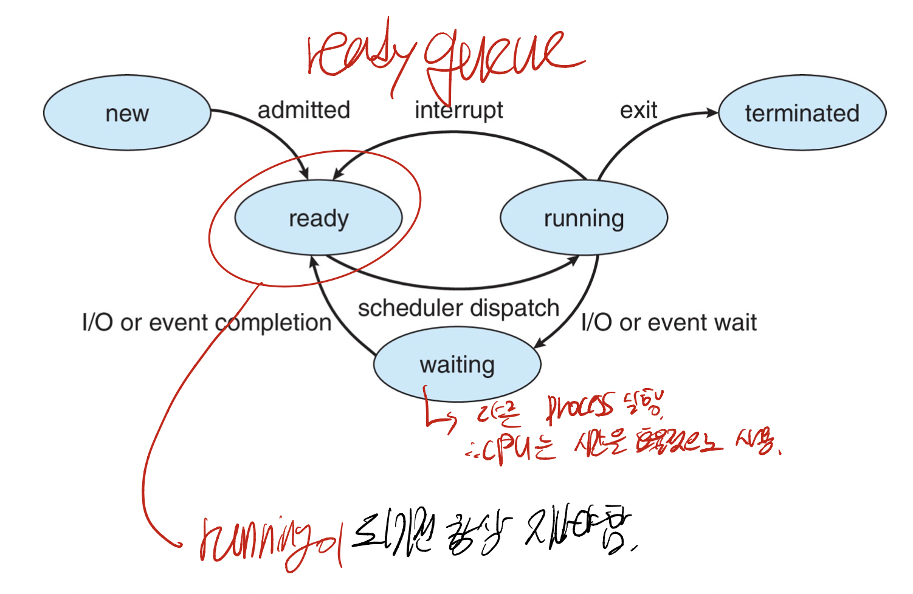
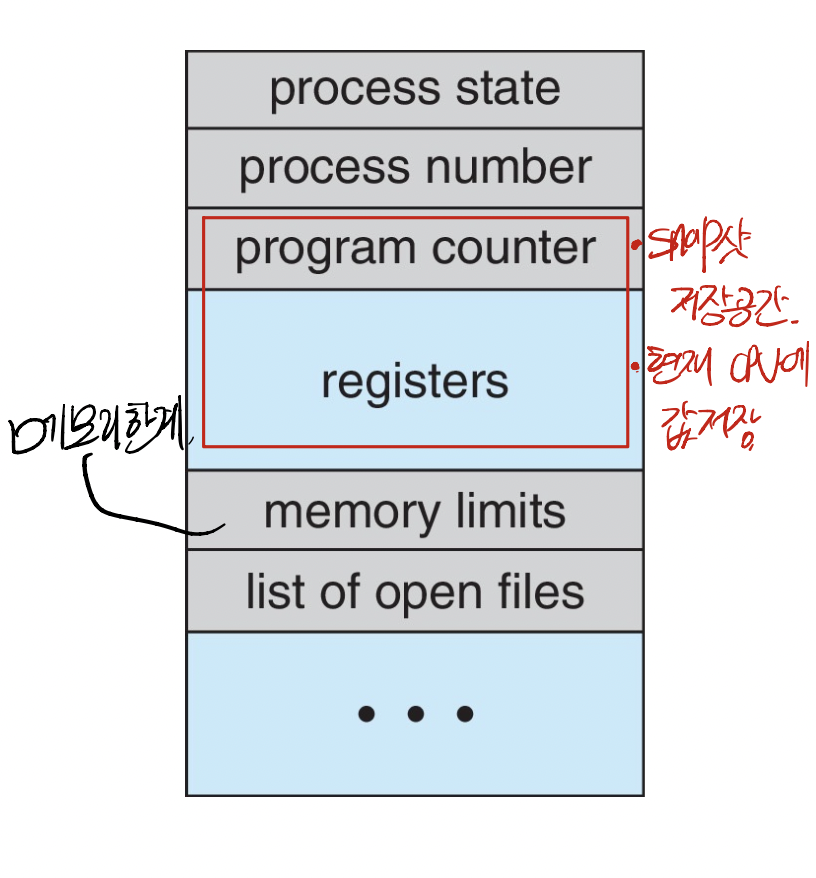
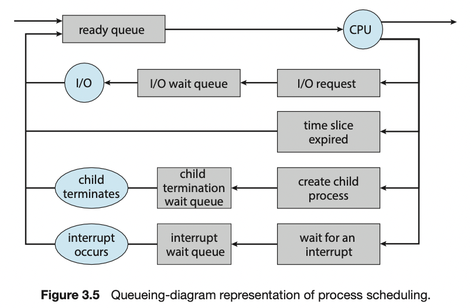
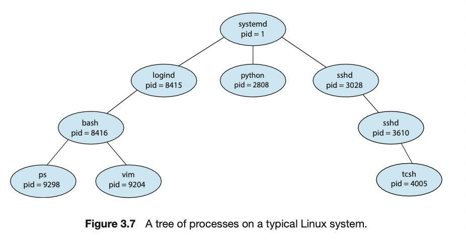

# Process

---

메모리에 다수의 프로그램들이 적재되어 병행 실행되는 것이 허용되는 오늘 날의 컴퓨터 <br> 
=> 이 때문에 다양한 프로그램을 보다 견고하게 제어하고 보다 구획화가 필요

**프로세스**의 등장 배경 => 실행 중인 프로그램. 시분할 시스템에서의 작업의 단위

> 실행 중인 프로그램이고 모든 계산의 기초가 되는 프로세스의 개념<br>
> 스케줄링, 생성 및 종료 등을 포함한 프로세스의 다양한 특성을 소개<br>
> 공유 메모리와 메시지 전달 기법을 사용한 프로세스 간 통신에 대해 탐구.<br>
> 클라이언트 - 서버 시스템에서의 통신에 대해 기술

## 프로세스 개념

---

### 프로세스

- 실행 중인 프로그램.
  - 프로그램 카운터의 값과 처리기 레지스터의 내용으로 대표되는 현재 활동을 포함.
  - 실행 파일이 메모리에 load될 때 프로그램은 프로세스가 됨.
- 프로세스는 임시적인 자료를 가지는 프로세스 **스택**(함수 매개변수, 복귀 주소, 로컬변수 등)<br>전역변수를 저장하는 **데이터**<br> 프로세스 실행 중에 동적으로 할당되는 **힙**<br>코드가 저장되어 있는 **text**
- 두 프로세스들은 동일한 프로그램에 연관이 가능하지만 별도의 실행순서로 간주
  - 또 비슷하게 프로세스가 실행되는 과정에서 다른 프로세스를 생성하는 것이 보통.

### 프로세스 상태

프로세스는 실행되면서 그 상태가 변한다. 그 상태는 현재의 활동에 따라서 정의된다.

- **new**
  - 프로세스가 생성 중인 상태
- **running**
  - 명령어가 실행되고 있는 상태
- **waiting**
  - 프로세스가 어떤 일이 일어나기를 기다리고 있는 상태
- **ready**
  - 프로세스가 처리기에 할당되기를 기다리는 상태
- **terminated**
  - 프로세스의 실행이 종료된 상태.

어느 한 순간에 한 처리기 상에는 오직 하나의 프로세스만이 실행될 수 있으므로 많은 프로세스는 준비완료 및 대기 상태에 있다.

### Process Control Block, PCB

프로세스 제어 블록은 특정 프로세스와 연관된 여러 정보를 기록한다.
- **process state**
  - ```new, ready, running, wating, halted``` 상태
- **Program Counter(PC)**
  - 다음에 실행할 명령어의 주소
- **CPU registers**
  - 컴퓨터의 구조에 따라 다양한 수와 타입을 가짐
  - accumulator, index register, stack register, general-purpose register, condition code 정보가 포함
  - 프로그램 카운터와 함께 이 상태 정보는 나중에 프로세스가 올바르게 실행되도록 하기 위해 인터럽트 발생시 저장되어야 한다.
- **CPU Scheduling information**
  - 프로세스의 우선순위, 스케줄링 큐에 대한 포인터와 다른 스케줄링 매개변수들을 포함
- **메모리 관리 정보**
  - OS에 의해 사용되는 메모리 시스템에 따라 base register와 limit register 값과 페이지 테이블, 세그먼트 테이브로가 같은 정보를 저장
- **accounting 정보**
  - CPU 사용시간과 경과된 실시간, 시간제한, 계정번호, job or process 번호를 포함
- **입출력 상태 정보**
  - 프로세스에게 할당된 입출력 장치들과 열린 파일의 목록을 포함

### Threads
- 현대의 운영체제는 프로세스 개념을 확장하여 하나의 프로세스가 다수의 실행 스레드를 가질 수 있게 허용
- 따라서 프로세스가 한번에 하나 이상의 일을 수행할 수 있도록 허영 => 스레드가 병렬로 실행 가능.
- PCB 내부에 Thread에 대한 정보도 저장되어 있어야 함.

## Process Scheduling

---
- **다중 프로그래밍의 목적**
  - CPU 이용을 최대화하기 위함.
- **시분할 프로그래밍의 목적**
  - 각 프로그램이 실행되는 동안 사용자가 상호작용 할 수 있도록 프로세스들 사이에서 CPU를 교체하는 것

이 목적을 달성하기 위해 **프로세스 스케줄러**는 CPU에서 실행가능한 여러 프로세스들 중에서 하나의 프로세스 선택<br>
만일 프로세스가 여러개 있고 하나의 프로세스가 실행 중이면 다른 프로세스는 대기

### Scheduling Queue
- 프로세스가 시스템에 들어오면 이들은 job queue에 들어가고 이 큐는 시스템 안의 모든 프로세스로 구성된다.
- 메인 메모리에 존재하며 준비완료 상태에서 실행을 대기하는 프로세스들은 ```ready queue``` 리스트 상에 유지된다.
  - 이 큐는 일반적으로 **연결 리스트**로 이루어져 있으며 헤더는 리스트의 첫번째와 마지막 PCB를 가지는 포인터를 포함.
  - 각 PCB는 준비 완료 큐에 있는 **다음 프로세스를 가리키는 포인터 필드**를 가짐
- 시스템에는 여러 큐가 존재하는데 특정 입출력 장치를 대기하는 프로세스들의 리스트를 wait(device) queue라고 함.
  - 각 device queue를 가진다.
- 프로세스 스케줄링의 공통적인 표현 방법은 queueing diagram

- 각 사각형은 하나의 큐를 나타내며 두가지 타입의 큐가 존재.
  - ```원```은 **큐를 서비스하는 자원**이고 ```화살표```는 **프로세스의 from을 표현**한다.
- 새로운 프로세스는 처음에 준비완료 큐에 놓인다.
- 프로세스는 실행을 위하여 선택될 때 CPU를 할당받을 때까지 준비 완료 큐에서 대기한다.
- 일단 프로세스에 CPU가 할당되어 실행되면 여러가지 사건들 중에 하나가 발생
  1. 프로세스가 입출력 요청을 하여 입출력 큐에 넣어질 수가 있다.
  2. 프로세스가 새로운 자식 프로세스를 생성하고 자식 프로세스의 종료를 기다릴 수 있다.
  3. 프로세스가 인터럽트의 결과에 의해 강제로 CPU로 부터 제거되고, 준비 완료 큐에 다시 놓일 수 있다.
처음 두 경우는 프로세스는 wait에서 ready 상태로 전환되고 ready queue에 넣어지게 되고<br> 
이 과정은 프로세스가 종료될 때까지 반복되며 종료되면 모든 큐에서 삭제되고 그 자신의 PCB와 자원을 반납한다.

### Scheduler
프로세스는 다양한 스케줄링 큐들 사이에서 이동한다. <br>
운영체제는 알고리즘에 따라 하나의 프로세스를 선택하게 되고 이것은 **스케줄러**에 의해 결정된다.

- ```장기 스케줄러(job scheduler)```는 이 풀에서 프로세스들을 선택하여 실행하기 위해 메모리로 load한다.
  - 실행 빈도수가 적음
  - 메모리에 있는 프로세스들의 수를 제어
  - 이 프로세스의 수가 안정적이면 프로세스의 생성률과 이탈률이 같아야한다.
  - 장기 스케줄러는 프로세스가 시스템을 떠날 때만 호출될 필요가 있다
- ```단기 스케줄러(CPU 스케줄러)```는 실행 준비가 완료되어 있는 프로세스들 중에서 선택하여 이들 중 하나에게 CPU를 할당한다.
  - CPU를 선점하기 위해 자주 새로운 프로세스를 선택해야 함.
  - 프로세스는 입출력 요청을 위해 대기 전까지 실행될 수 있다.
  - 매우 빨라야 한다.(프로세스 교체에 CPU를 낭비 폭을 낮추기 위해)
> 현대 시대의 OS는 가상메모리를 통해 장기 스케줄러를 잘 사용하지 않는다고 한다.

### Context Switch

> 인터럽트를 통해 OS가 CPU를 현재 작업에서 빼앗아 커널 루틴을 실행할 수 있게 한다.<br>
> 인터럽트가 발생하면 시스템은 인터럽트 처리가 끝난 후에 Context를 복구할 수 있도록 현재 실행중인 프로세스의 현재 Context를 저장할 필요가 있고<br>
> 이는 프로세스를 중단했다가 재개하는 작업

- **Context**
  - 프로세스의 PCB에 표현된 정보
  - CPU 레지스터의 값, 프로세스 상태, 메모리 관리 정보 등
- OS가 커널모드이건, 사용자모드이건 CPU 상태를 저장하는 작업을 수행하고 연산을 재개하기 위해서 수행한다.
- CPU를 다른 프로세스로 전환하려면 이전 프로세스의 상태를 보관하고 새로운 프로세스의 보관된 상태를 복구하는 작업이 필요<br> => **Context Switch**
- 커널은 과거 프로세스의 문맥을 PCB에 저장하고, 스케줄 된 새로운 프로세스의 저장된 문맥을 복구한다. 
  - 이것이 진행될 동안 시스템은 아무런 유용한 일을 못하기 때문에 Context Switch는 오버헤드가 큰 작업.
  - Context Switch 시간은 하드웨어 자원에 따라 좌우되며 메모리 관리 기법에 따라 크게 달라진다.

## 프로세스에 대한 연산

---
대부분의 시스템 내의 프로세스들은 병행 실행될 수 있으며, 동적으로 생성되고 제거되어야한다.<br>
운영체제는 이를 위한 프로세스 생성 및 종료를 위한 기법을 제공해야 함.

### Process Creation

실행되는 동안의 프로세스느 다른 프로세스를 생성할 수 있는데 생성하는 프로세스를 **부모 프로세스**, 생성된 프로세스를 **자식 프로세스**라 함.

대부분의 현대 OS는 유일한 **프로세스 식별자(PID)**를 사용하여 프로세스를 구분하는데 각 프로세스의 고유한 값이고, index처럼 사용이 가능하다.

(UNIX의 경우)
pid가 1인 것은 언제나 init 프로세스이고, 모든 프로세스의 부모 역할을 한다.
시스템이 부팅되면 init 프로세스가 여러 프로세스를 생성한다.

일반적으로 프로세스가 자식 프로세스를 생성할 때 자식 프로세스는 자신의 임무를 달성하기 위해 어떤 자원(CPU 시간, 메모리, 파일, 입출력 장치)가 필요.
자식 프로세스는 이 자원을 OS로부터 얻거나 부모 프로세스가 가진 자원의 일부를 사용할 수 있다.<br>
=> 이르 통해 시스템의 과부화 방지

**프로세스가 새로운 프로세스를 생성할 때 실행시키는 두가지 가능한 방법**
1. 부모와 자식을 병행하게 실행
2. 부모는 일부 또는 모든 자식이 실행을 종료할 때까지 기다림.

새로운 프로세스들의 주소 공간 측면에서 볼 때 두가지 가능성 존재.
1. 자식 프로세스는 부모 프로세스의 복사본
2. 자식 프로세스가 새로운 프로그램


- ```fork()```의 반환 값이 자식 프로세스는 **0**, 부모 프로세스는 **0이 아닌 값**(자식 프로세스의 PID)
- ```fork()``` system call 이후 ```exec()``` system call을 사용하며 ㄴ자신의 메모리 공간을 새로운 프로그램으로 교체.
- exec()는 오류가 발생하지 않는 한 제어를 바노한하지 않으며 부모는 자식이 종료될 때까지 ready queue에서 자신을 제거하기 위해 ```wait()``` system call을 사용

### Process Termination
프로세스가 마지막 문장의 실행을 끝내고 ```exit()``` system call을 사용하여 운영체제에게 자신의 삭제를 요청하면 종료한다.<br> 
프로세스는 자신의 부모 프로세스에게 **상태 값을 반환**한다. <br>
모든 자원들(메모리, 파일, 입출력 버퍼 등..) 운영체제에게 반환한다.

부모가 자식의 PID를 이용하여 프로세스를 종료시킬 수 있는데 다음과 같은 이유에 그 동작이 가능하다.
- 자식이 자신에게 할당된 자원을 초과하여 사용할 때
- 자식에게 할당된 task가 더이상 없을 때
- 부모가 exit하는데 자식이 아직 남아있을 때

프로세스의 종료 상태가 저장되는 프로세스 테이블의 해당 항목은 부모 프로세스가 ```wait()```을 호출할 때까지 남아있게 된다.<br>
종료 되었지만 부모 프로세스가 아직 ```wait()```을 호출하지 않는 프로세스를 **좀비 프로세스**라고 한다.<br>
종료하게 되면 모든 프로세스는 좀비 상태가 되지만 아주 짧은 시간동안만 머무르고 부모가 wait을 호출하면 좀비 프로세스의 프로세스 식별자와 프로세스 테이블의 해당 항목이 운영체제에게 반환된다.

부모 프로세스가 ```wait()```을 호출하는 대신 종료한다면 잦식 프로세스는 **고아 프로세스**가 된다.<br>
고아 프로세스는 init 프로세스를 부모 프로세스로 만들고 init 프로세스는 주기적으로 ```wait()```호출하여 고아 프로세스의 종료 상태를 수집하여 프로세스 식별자와 테이블 항목을 반환한다.

## 프로세스 간 통신(Interprocess Communication, IPC)

---

OS 내에서 실행되는 병행 프로세스들은 독립적이거나 협력적인 프로세스<br>
프로세스가 다른 프로세스에게 영향을 주지 않거나 받지 않는다면 독립적인 프로세스라고 하고 데이터를 주고받으면 협력적인 프로세스라고 함.<br>
프로세스들이 협력을 허용하는 환경은 몇가지 이유가 존재

- 정보 공유
  - 여러 사용자가 동일한 정보에 관심이 있을 수 있으므로 병행적으로 접근할 수 있는 환경을 제공
- dfa 계산 가속화
  - 특정 테스크를 빨리 실행하고자 할 때 서브 테스크로 나누어 이들이 각각 다른 서브 테스크들과 병렬로 실행되게 함.<br> => 복수 코어가 있을 때만 가능함
- 모듈성
  - 시스템 기능을 별도의 프로세스들, 스레드들로 나누어 모듈식 형태로 시스템을 구성
- 편의성
  - 개별 사용자들이 한순간에 많은 테스크를 가질 수도 있음.

프로세스 간 통신에는 기본적으로 **공유메모리(Shared Memory)**와 **메시지 전달(Message Passing)**이 있다.
공유 메모리는 정보를 교환할 수 있고, 메시지 전달은 협력 프로세스들 사이에 교환되는 메시지를 통하여 이루어진다.

메시지 전달은 충돌을 회피할 필요가 없기 때문에 적은 양의 데이터를 교환하는데 유용하고, 구현하기 쉽다.
공유 메모리는 메시지를 전달하는 방식이 아니기 때문에 메모리 복사 등 시간이 절약되므로 더 빠르고 공유 메모리 영역을 생성할 때에 System call이 필요하다.

### 공유 메모리 시스템
- 공유 메모리 존재. 영역 생성
- 공유 메모리 세그먼트를 생성하는 프로세스의 주소 공간에 위치
- 공유 메모리 세그먼트를 이용하여 통신하고자 하는 다른 프로세스들은 이 세그먼트를 자신의 주소공간에 추가
- 공유 메모리는 둘 이상의 프로세스가 메모리 접근에 대해 동의하고 그 이후 공유 영역에 읽고 씀으로써 정보를 교환할 수 있다.

### 메시지 전달 시스템
동일한 주소 공간을 공유하지 않고 프로세스들이 통신을 하고 동작을 동기화할 수 있도록 허용하는 기법

네트워크에 의해 연결된 다른 컴퓨터들에 존재하는 분산 환경에서 유용한데, 프로세스가 보낸 길이가 고정 길이일 수도 있고 가변 길이일 수도 있다.
프로세스 사이에 메시지를 전달하려면 통신 연결이 설정되어 있어야 한다.
- 직접 또는 간접 통신
- 동기식 또는 비동기식 통신
- 자동 또는 명시적 버퍼링

**Naming**
통신을 워하는 프로세스끼리 서로를 통신할 수 있는 방법 => 직접 통신, 간접 통신
- **직접통신**
  - 통신을 원하는 프로세스는 통신의 수신자 또는 송신자의 이름을 명시
  - 통신을 원하는 각 프로세스의 쌍들 사이에 연결이 자동적으로 구축<br> 프로세스들은 통신하기 위해 상대방의 id만 알면 된다.
  - 연결은 두 프로세스들 사이에만 연관된다.
  - 통신하는 프로세스들의 각 쌍사이에는 정확하게 하나의 연결이 존재한다.
- **간접통신**
  - 메시지들은 메일박스 또는 포트로 송신되고 그것으로부터 수신된다.
  - 메일 박스는 메시지들을 넣어주기도 하며 제거되기도 하고 고유의 id 값을 가진다.
  - 한 쌍의 프로세스들 사이의 연결은 이들 프로세스가 공유 메일 박스를 가질 때만 구축된다.
  - 연결은 두개 이상의 프로세스들과 연관될 수 있다.
  - 통신하고 있는 각 프로세스들 사이에는 다수의 서로 다른 연결이 존재할 수 있고, 각 연결은 하나의 메일박스에 대응된다.

**Synchronization**
메시지 전달은 blocking이나 non-blocking 방식으로 전달되고 이를 **동기식, 비동기식** 이라 표현한다.
- blocking
  - send
    - 송신하는 프로세스는 메시지가 수신 프로세스 또는 메일 박스에 의해 수신될 때까지 blocking 한다
  - receive
    - 수신자는 메시지가 도착할 때까지 blocking 한다.
- non-blocking
  - send
    - 송신하는 프로세스가 메시지를 보내고 작업을 재개한다.
  - receive
    - 수신자는 유효한 메시지를 받거나 null을 받는다.

**Buffering**
통신되는 메시지는 임시 큐에 저장되는데 이러한 큐를 구현하는 방법은 세가지가 있다.
- zero capacity
  - 큐의 최대 크기가 0
  - 링크는 대기하는 메시지들을 가질 수 없다.<br> => 송신자는 수신자가 메시지를 수신할 때까지 기다려야 한다.
- bounded capacity
  - 큐는 유한 크기의 n을 가진다.
  - 새로운 메시지가 전송될 때 queue가 full이 아니면 메시지에 넣고 만약 full이면 송신자는 넣을 수 없어야 한다.<br> 반드시 blocking이 되어야 한다.
- unbounded capacity
  - 큐는 잠재적으로 무한한 길이를 가진다.
  - 메시지들이 얼마든지 큐 안에서 대기할 수 없다.
  - 송신자는 blocking 되지 않는다.