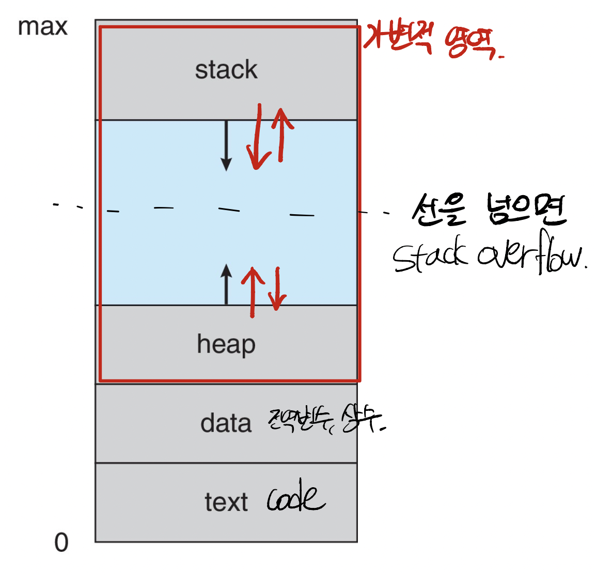
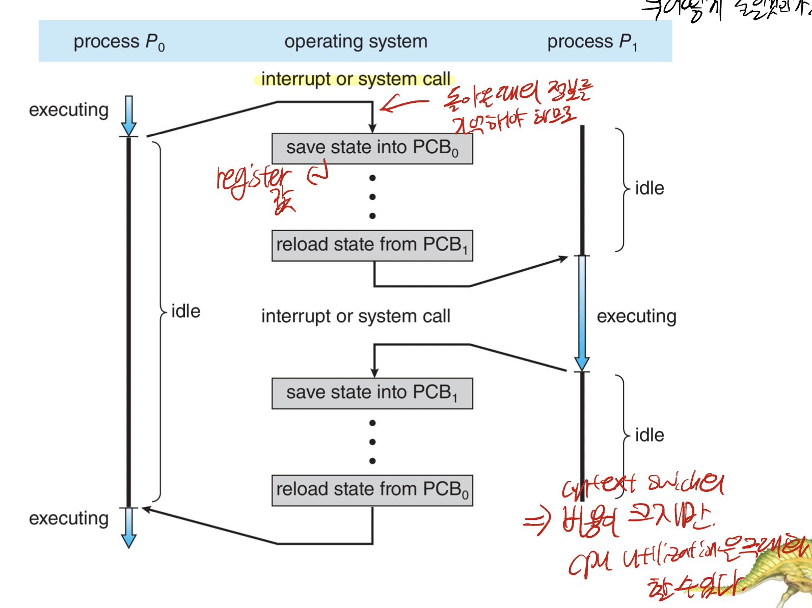

# Process

---

메모리에 다수의 프로그램들이 적재되어 병행 실행되는 것이 허용되는 오늘 날의 컴퓨터 <br> 
=> 이 때문에 다양한 프로그램을 보다 견고하게 제어하고 보다 구획화가 필요

**프로세스**의 등장 배경 => 실행 중인 프로그램. 시분할 시스템에서의 작업의 단위

> 실행 중인 프로그램이고 모든 계산의 기초가 되는 프로세스의 개념<br>
> 스케줄링, 생성 및 종료 등을 포함한 프로세스의 다양한 특성을 소개<br>
> 공유 메모리와 메시지 전달 기법을 사용한 프로세스 간 통신에 대해 탐구.<br>
> 클라이언트 - 서버 시스템에서의 통신에 대해 기술

## 프로세스 개념

---

### 프로세스

- 실행 중인 프로그램.
  - 프로그램 카운터의 값과 처리기 레지스터의 내용으로 대표되는 현재 활동을 포함.
  - 실행 파일이 메모리에 load될 때 프로그램은 프로세스가 됨.
- 프로세스는 임시적인 자료를 가지는 프로세스 **스택**(함수 매개변수, 복귀 주소, 로컬변수 등)<br>전역변수를 저장하는 **데이터**<br> 프로세스 실행 중에 동적으로 할당되는 **힙**<br>코드가 저장되어 있는 **text**
- 두 프로세스들은 동일한 프로그램에 연관이 가능하지만 별도의 실행순서로 간주
  - 또 비슷하게 프로세스가 실행되는 과정에서 다른 프로세스를 생성하는 것이 보통.

### 프로세스 상태

프로세스는 실행되면서 그 상태가 변한다. 그 상태는 현재의 활동에 따라서 정의된다.

- **new**
  - 프로세스가 생성 중인 상태
- **running**
  - 명령어가 실행되고 있는 상태
- **waiting**
  - 프로세스가 어떤 일이 일어나기를 기다리고 있는 상태
- **ready**
  - 프로세스가 처리기에 할당되기를 기다리는 상태
- **terminated**
  - 프로세스의 실행이 종료된 상태.

어느 한 순간에 한 처리기 상에는 오직 하나의 프로세스만이 실행될 수 있으므로 많은 프로세스는 준비완료 및 대기 상태에 있다.

### Process Control Block, PCB

프로세스 제어 블록은 특정 프로세스와 연관된 여러 정보를 기록한다.
- **process state**
  - ```new, ready, running, wating, halted``` 상태
- **Program Counter(PC)**
  - 다음에 실행할 명령어의 주소
- **CPU registers**
  - 컴퓨터의 구조에 따라 다양한 수와 타입을 가짐
  - accumulator, index register, stack register, general-purpose register, condition code 정보가 포함
  - 프로그램 카운터와 함께 이 상태 정보는 나중에 프로세스가 올바르게 실행되도록 하기 위해 인터럽트 발생시 저장되어야 한다.
- **CPU Scheduling information**
  - 프로세스의 우선순위, 스케줄링 큐에 대한 포인터와 다른 스케줄링 매개변수들을 포함
- **메모리 관리 정보**
  - OS에 의해 사용되는 메모리 시스템에 따라 base register와 limit register 값과 페이지 테이블, 세그먼트 테이브로가 같은 정보를 저장
- **accounting 정보**
  - CPU 사용시간과 경과된 실시간, 시간제한, 계정번호, job or process 번호를 포함
- **입출력 상태 정보**
  - 프로세스에게 할당된 입출력 장치들과 열린 파일의 목록을 포함

### Threads
- 현대의 운영체제는 프로세스 개념을 확장하여 하나의 프로세스가 다수의 실행 스레드를 가질 수 있게 허용
- 따라서 프로세스가 한번에 하나 이상의 일을 수행할 수 있도록 허영 => 스레드가 병렬로 실행 가능.
- PCB 내부에 Thread에 대한 정보도 저장되어 있어야 함.

## Process Scheduling

---
- **다중 프로그래밍의 목적**
  - CPU 이용을 최대화하기 위함.
- **시분할 프로그래밍의 목적**
  - 각 프로그램이 실행되는 동안 사용자가 상호작용 할 수 있도록 프로세스들 사이에서 CPU를 교체하는 것

이 목적을 달성하기 위해 **프로세스 스케줄러**는 CPU에서 실행가능한 여러 프로세스들 중에서 하나의 프로세스 선택<br>
만일 프로세스가 여러개 있고 하나의 프로세스가 실행 중이면 다른 프로세스는 대기

### Scheduling Queue
- 프로세스가 시스템에 들어오면 이들은 job queue에 들어가고 이 큐는 시스템 안의 모든 프로세스로 구성된다.
- 메인 메모리에 존재하며 준비완료 상태에서 실행을 대기하는 프로세스들은 ```ready queue``` 리스트 상에 유지된다.
  - 이 큐는 일반적으로 **연결 리스트**로 이루어져 있으며 헤더는 리스트의 첫번째와 마지막 PCB를 가지는 포인터를 포함.
  - 각 PCB는 준비 완료 큐에 있는 **다음 프로세스를 가리키는 포인터 필드**를 가짐
- 시스템에는 여러 큐가 존재하는데 특정 입출력 장치를 대기하는 프로세스들의 리스트를 wait(device) queue라고 함.
  - 각 device queue를 가진다.
- 프로세스 스케줄링의 공통적인 표현 방법은 queueing diagram

- 각 사각형은 하나의 큐를 나타내며 두가지 타입의 큐가 존재.
  - ```원```은 **큐를 서비스하는 자원**이고 ```화살표```는 **프로세스의 from을 표현**한다.
- 새로운 프로세스는 처음에 준비완료 큐에 놓인다.
- 프로세스는 실행을 위하여 선택될 때 CPU를 할당받을 때까지 준비 완료 큐에서 대기한다.
- 일단 프로세스에 CPU가 할당되어 실행되면 여러가지 사건들 중에 하나가 발생
  1. 프로세스가 입출력 요청을 하여 입출력 큐에 넣어질 수가 있다.
  2. 프로세스가 새로운 자식 프로세스를 생성하고 자식 프로세스의 종료를 기다릴 수 있다.
  3. 프로세스가 인터럽트의 결과에 의해 강제로 CPU로 부터 제거되고, 준비 완료 큐에 다시 놓일 수 있다.
처음 두 경우는 프로세스는 wait에서 ready 상태로 전환되고 ready queue에 넣어지게 되고<br> 
이 과정은 프로세스가 종료될 때까지 반복되며 종료되면 모든 큐에서 삭제되고 그 자신의 PCB와 자원을 반납한다.

### Scheduler
프로세스는 다양한 스케줄링 큐들 사이에서 이동한다. <br>
운영체제는 알고리즘에 따라 하나의 프로세스를 선택하게 되고 이것은 **스케줄러**에 의해 결정된다.

- ```장기 스케줄러(job scheduler)```는 이 풀에서 프로세스들을 선택하여 실행하기 위해 메모리로 load한다.
  - 실행 빈도수가 적음
  - 메모리에 있는 프로세스들의 수를 제어
  - 이 프로세스의 수가 안정적이면 프로세스의 생성률과 이탈률이 같아야한다.
  - 장기 스케줄러는 프로세스가 시스템을 떠날 때만 호출될 필요가 있다
- ```단기 스케줄러(CPU 스케줄러)```는 실행 준비가 완료되어 있는 프로세스들 중에서 선택하여 이들 중 하나에게 CPU를 할당한다.
  - CPU를 선점하기 위해 자주 새로운 프로세스를 선택해야 함.
  - 프로세스는 입출력 요청을 위해 대기 전까지 실행될 수 있다.
  - 매우 빨라야 한다.(프로세스 교체에 CPU를 낭비 폭을 낮추기 위해)
> 현대 시대의 OS는 가상메모리를 통해 장기 스케줄러를 잘 사용하지 않는다고 한다.

### Context Switch

> 인터럽트를 통해 OS가 CPU를 현재 작업에서 빼앗아 커널 루틴을 실행할 수 있게 한다.<br>
> 인터럽트가 발생하면 시스템은 인터럽트 처리가 끝난 후에 Context를 복구할 수 있도록 현재 실행중인 프로세스의 현재 Context를 저장할 필요가 있고<br>
> 이는 프로세스를 중단했다가 재개하는 작업

- **Context**
  - 프로세스의 PCB에 표현된 정보
  - CPU 레지스터의 값, 프로세스 상태, 메모리 관리 정보 등
- OS가 커널모드이건, 사용자모드이건 CPU 상태를 저장하는 작업을 수행하고 연산을 재개하기 위해서 수행한다.
- CPU를 다른 프로세스로 전환하려면 이전 프로세스의 상태를 보관하고 새로운 프로세스의 보관된 상태를 복구하는 작업이 필요<br> => **Context Switch**
- 커널은 과거 프로세스의 문맥을 PCB에 저장하고, 스케줄 된 새로운 프로세스의 저장된 문맥을 복구한다. 
  - 이것이 진행될 동안 시스템은 아무런 유용한 일을 못하기 때문에 Context Switch는 오버헤드가 큰 작업.
  - Context Switch 시간은 하드웨어 자원에 따라 좌우되며 메모리 관리 기법에 따라 크게 달라진다.